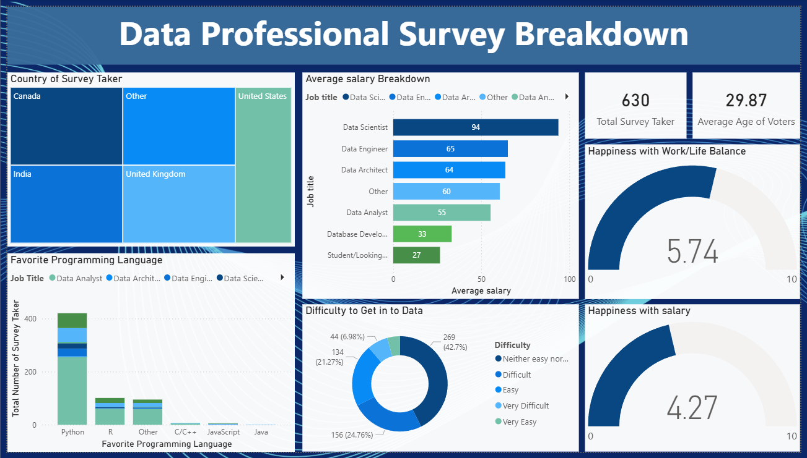

# Data Professional Survey Analysis (Power BI Project)

## Project Overview
This dashboard provides a comprehensive analysis of the Data Professional Survey data. The goal was to visualize key trends in the data industry, including salary distributions, favorite programming languages, and workplace satisfaction across different demographics.

## Dashboard Preview

## Technical Skills Applied
* **Power Query:** * Data Cleaning: Standardized job titles and programming languages using delimiters.
    * Data Transformation: Converted messy salary strings into numeric values for calculation.
* **DAX & Measures:** Created custom measures for average age and happiness scores.
* **Data Visualization:** * Tree Maps for geographic distribution.
    * Gauge Charts for happiness metrics.
    * Stacked Bar Charts for salary comparisons.

## Key Insights
* **Top Roles:** Data Scientists earn the highest average salary ($93k) among respondents.
* **Tools:** Python remains the most popular programming language in the data community.
* **Global Trends:** Most survey takers are from the US, India, and the UK.

## How to View
1. Download the `Survey_Analysis.pbix` file.
2. Open it using [Microsoft Power BI Desktop](https://powerbi.microsoft.com/desktop/).
